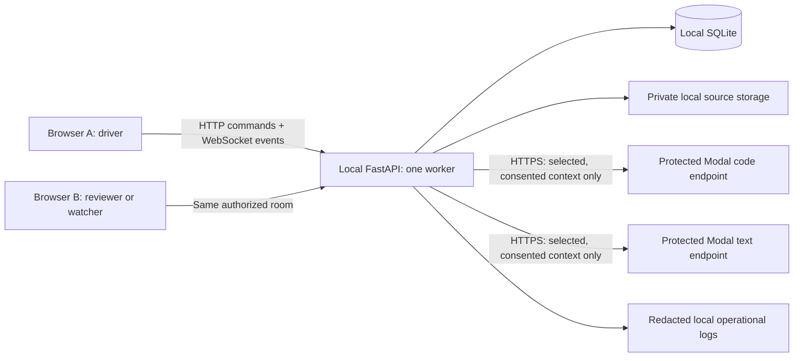

# Architecture — TOLTI AI

**Draft v0.1 · 7 September 2026 · Owner: Alok · Reviewers: Anshuman + Tipsy**

This is the proposed build contract, not an as-built diagram. The source plan fixes the main stack and deployment boundary. Protocol details below require G0 approval. See [decisions](decisions.md) for assumptions.

## 1. System boundary



**Browser → local FastAPI → protected Modal endpoints.** Browsers never hold provider credentials or call model endpoints directly. Local hosting does not make inference offline. Original source files remain local, but selected extracted text, instructions and bounded conversation context leave for Modal only after consent. Do not claim the provider retains nothing without verifying its deployed configuration and policy.

Only public/synthetic demonstration material is allowed under the initial policy. The app must not silently replace Modal with another cloud provider if it fails. An on-premise provider is a possible future adapter, not delivered functionality.

## 2. Stack and repository

```text
tolti-ai/
├── frontend/
│   ├── src/
│   │   ├── components/       # Room shell, composer, common controls
│   │   ├── views/            # Chat, Documents, Code, Agent
│   │   ├── panels/           # People, sources, review, activity
│   │   ├── lib/              # Client, generated types, durable reducer
│   │   ├── App.tsx
│   │   ├── main.tsx
│   │   └── styles.css        # Preserve existing dark tokens/styles
│   ├── tests/
│   ├── package.json
│   ├── package-lock.json
│   └── vite.config.ts
├── backend/
│   ├── app/
│   │   ├── main.py           # Composition/setup, not business logic
│   │   ├── api/              # HTTP/WS transport and dependencies
│   │   ├── schemas/          # Pydantic requests/results/event union
│   │   ├── services/         # Rooms, runs, review and invariants
│   │   ├── repositories/     # Scoped SQLAlchemy queries/transactions
│   │   ├── providers/        # Protected Modal transport adapters
│   │   ├── workflows/        # Router and bounded workflow prompts
│   │   └── core/             # Settings, database, redacted logging
│   ├── migrations/
│   ├── tests/
│   ├── pyproject.toml
│   └── uv.lock
├── infra/modal/              # GPU/model deployment; separate deps/lock
├── docs/
├── scripts/                  # Create only as each slice needs them
└── data/                     # Runtime DB/uploads/logs; ignored by Git
```

Use Python 3.12, FastAPI, Pydantic v2, SQLAlchemy 2, Alembic and SQLite; React, strict TypeScript and Vite. Use uv for Python and npm for frontend; create and commit real locks during G1. This pack does not contain those locks or claim the tree exists. No empty framework scaffolding, Tailwind rewrite or new orchestration dependency is needed.

## 3. Layer responsibilities

| Layer | Owns | Must not own |
| --- | --- | --- |
| API transport | Validate inputs, session/Origin/CSRF dependencies, serialize responses | Business transitions, direct model calls, authorization based on browser state |
| Services | Membership, roles, idempotency, run/review transitions, transaction boundaries | Provider-specific HTTP parsing or giant generic agent framework |
| Repositories | Room-scoped reads, database constraints and persistence helpers | Authorization inferred only from an unscoped ID |
| Workflows | Allowlisted route selection, bounded prompts, typed output/provenance validation | Host tools, shell execution or policy decisions delegated to an LLM |
| Providers | Fixed-endpoint HTTP transport, stream parsing, timeouts, sanitized errors | Room permissions, database transactions or browser credentials |
| Frontend | Derived server state, local view state, safe rendering, focus/recovery | Authoritative role, approval or run state |

External HTTP/event schemas are defined in Pydantic and generate frontend types after implementation. Do not maintain hand-edited duplicate API types. Event schemas need an explicit export; ordinary HTTP OpenAPI alone does not document WebSocket event payloads.

## 4. Deployment modes

**Development:** Vite on `localhost:5173`, FastAPI on `localhost:8000`; Vite proxies `/api` and `/ws`. Browser requests use a single origin. Frontend fixture mode is explicit, development-only and visibly labeled.

**Local demo:** build `frontend/dist`; FastAPI serves it alongside `/api` and `/ws`. Register API/WS/private-file routes before the SPA fallback; API 404s must not become HTML 200s. Use one application worker so the in-process event publisher and run supervisor are coherent.

**LAN security:** default development binding is loopback. The proposed multi-device baseline is HTTPS with a certificate trusted by the actual devices, exact Origin allowlists and secure cookies. Do not expose a dev server or disable security to solve a connection problem. Final OS/certificate/proxy decisions remain open. Any insecure LAN exception requires an explicit risk decision; it is not authorized by this document.

**Modal:** deploy separately using approved credentials/budget and current official documentation. GPU/model libraries do not enter the local backend environment. Candidate models are Qwen2.5-Coder-7B-Instruct and Qwen3-8B in non-thinking mode. Revisions and GPU fit are unverified until smoke tests.

## 5. Durable data model

Use opaque UUIDs for entities and integers for per-room sequence/revision counters. Store timestamps as UTC ISO-8601; render in the user's locale. Enable foreign keys, a reviewed busy timeout and WAL behavior; backups must account for WAL.

| Entity | Minimum fields / key constraints |
| --- | --- |
| principals / sessions | Stable anonymous `principal_id`, display name; hashed high-entropy session token, expiry, revocation and CSRF binding. Session rotation retains principal identity. |
| rooms | Host principal, current driver reference, `revision`, `last_seq`; active room always has one designated driver. |
| memberships | Unique `(room_id, principal_id)`, task role; partial unique index for one driver per room. Service maintains driver pointer and role atomically. |
| invites | Room, token hash, expiry, consumed/revoked state. Single use; plaintext returned only at creation. |
| sources / excerpts | Room, content hash, safe storage key, type, parse state, page/line locations and coverage. Original bytes/extracted excerpts are version-fixed. |
| preflights | Initiator, room, normalized intent, allowlisted route, immutable input manifest/digest, expiry and consumed run reference. |
| runs | Room, initiator, preflight, route/model metadata, status, dispatch marker, cancellation/error/timing metadata. Unique consumed preflight; partial unique active-run index per room. |
| artifacts / artifact_versions | Artifact identity and current version pointer; append-only version content/hash, run reference, author-principal set and citations. Unique `(artifact_id, version_number)`. |
| review_requests / decisions | Exact version/hash, submitter, review revision/status; decision actor, outcome and timestamp. One terminal decision per review request. |
| room_events | Unique `(room_id, seq)`, event type/schema version, actor/resource references and bounded payload; append-only through application policy. |
| idempotency_records | Actor + operation/path + key, request fingerprint and result reference. No provider credentials, invite tokens or full request bodies. |

“Append-only” describes application behavior, not tamper-proof storage. Someone with database/filesystem access can alter SQLite or files. No source hard-deletion endpoint is included while artifacts reference evidence.

## 6. Starting a run

1. Authenticate, validate Origin/CSRF, check current room membership/driver role and input limits.
2. Build a local preflight from selected source snapshots and direct user intent. Auto ambiguity returns clarification without dispatching a provider.
3. Show the model choice, reason and exact egress manifest. Obtain explicit consent tied to its digest.
4. In one short transaction: recheck driver/limits/source hashes, consume the preflight, enforce idempotency and reserve the room's active-run slot; insert `queued` run and event; commit.
5. After commit, publish the durable event and hand the run to a bounded in-process supervisor. Never use a DB transaction during remote I/O.
6. Store a dispatch-start marker before the outbound attempt. Stream provisional deltas separately from durable history. No automatic retry once the remote request may have been sent.
7. On valid completion, one compare-and-swap transaction writes the artifact/version, terminal run state and durable events; commit before publishing.
8. On timeout, malformed output or cancellation, persist the actual terminal result. Partial preview text is not a completed artifact. A new paid attempt requires a new preflight and consent.

Only one active run per room; propose global inference concurrency one initially and a bounded queue. This is a simplicity limit, not a measured capacity claim. Queue/timeout values live in [provider contract](provider-contract.md).

## 7. Review and version integrity

- Persist a version before requesting review; hash the canonical stored content, including provenance/coverage.
- Driver submits the current version and hash. A reviewer must have the current reviewer role and a principal different from all version authors and the submitter.
- Approval/changes-requested uses version/hash + review revision compare-and-swap. Never accept a stale tab's decision.
- Changing content creates another version, with the union of prior authors and the revising principal. It starts in draft. Supersede any open prior review; retain old terminal decisions as historical.
- Official export requires the **current approved version**. The export contains version/hash, decision, source references and limitations; code is Not executed and an inspection note remains advisory.

Browser-session identity cannot prove two different humans. The demo requires a trusted host and a real independent reviewer; production identity is out of scope.

## 8. Snapshot, events and reconnect

A snapshot is read in a single database transaction with the room's high-water sequence `S`. The client then opens an authenticated WebSocket requesting events after `S`.

For the single-worker server: register a bounded live-event buffer **before** reading replay high-water `H`; replay durable `S < seq <= H` in order; drain buffered events with `seq` greater than the last delivered value; then continue live. Duplicates around the boundary are expected and discarded. This prevents missing a commit between snapshot and subscription. On overflow or unrecoverable gaps, send a recovery instruction and take a fresh snapshot.

The frontend applies only contiguous durable events through one tested reducer. A transient token delta has a `run_id` and `delta_index`, not a durable room sequence. It may be lost on reconnect. On terminal state or new snapshot, saved server content replaces the provisional stream. Do not invent missing text or claim deltas are a durable audit record.

Keep room history for the controlled demo. Future pruning needs an explicit cursor-expiry contract. Disconnect/role revocation/session expiry revalidate access, rather than leaving a permanently authorized socket open.

## 9. Restart and failure recovery

Before readiness, after migration: atomically mark all persisted `queued`, `running` or `cancelling` runs as `interrupted`, release active slots and append recovery events. Do not redispatch them automatically; remote completion or billing may be unknown. Completed artifacts/decisions remain readable.

If an event was committed but not broadcast before a crash, replay supplies it after restart. If a provider responded but the completion transaction failed, do not present a fabricated saved success. Expose the persisted state and recovery guidance.

Provider failure must not make the local health endpoint claim the entire server is down. Report local readiness and model configuration/reachability/inference evidence separately.

## 10. Migration and implementation order

1. Identity, rooms, memberships, invites, ordered events and idempotency.
2. Sources/excerpts, preflights, runs and active-run uniqueness.
3. Artifacts, append-only versions, review requests and terminal decisions.
4. Add only schema changes required for approved extensions.

Migration files and generated API types are shared ownership boundaries. One integrator reviews changes; avoid parallel competing edits. Required failure/concurrency tests are in [testing](testing.md). Backup and verified recovery precede a demo migration.